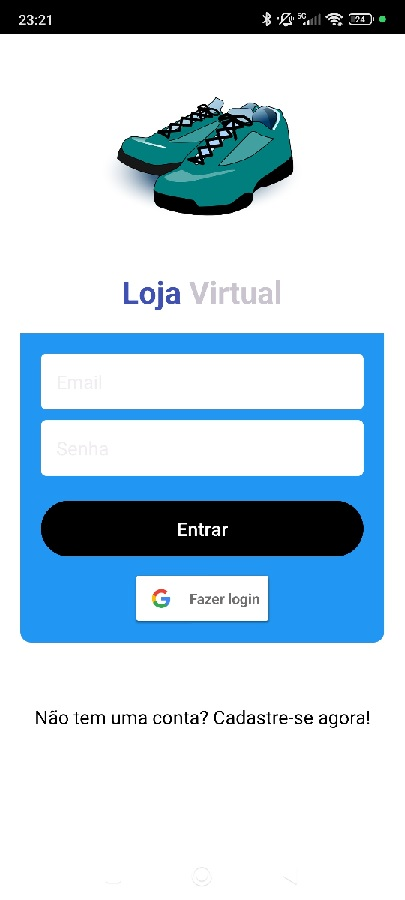
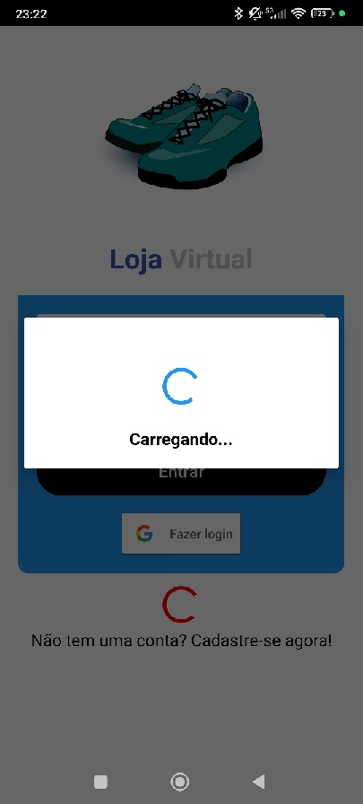

# DESCRIÇÃO DAS TELAS DO APLICATIVO:

# Código: `FormLogin` - Autenticação de Usuário com Email, Senha e Google

O código implementa uma tela de login para um aplicativo Android utilizando o Firebase Authentication, Google Sign-In e Firestore. A classe principal `FormLogin` é uma `AppCompatActivity` que gerencia o fluxo de login, autenticação e redirecionamento do usuário.

## Estrutura

### Importações
O código utiliza várias bibliotecas, incluindo:
- `FirebaseAuth` para autenticação com o Firebase.
- `GoogleSignIn` e `GoogleSignInClient` para login com Google.
- `Firestore` para armazenamento de dados no Firebase.
- `ViewCompat` e `WindowInsetsCompat` para manipulação de interface e insets de janela.
- `Snackbar` e `Toast` para exibição de mensagens.

### Inicialização de Variáveis
- `binding`: Usado para vincular os elementos da interface (`ActivityFormLoginBinding`).
- `googleSignInClient`: Configura o cliente de login do Google.
- `mAuth`: Usado para gerenciar a autenticação do Firebase.

### Constantes
- `LOGIN_REQUEST_CODE` e `RC_SIGN_IN`: Usadas para identificar requisições de login.

## `onCreate()`: Configuração Inicial
- Habilita o modo "Edge-to-Edge" para tela cheia.
- Configura o layout com `ActivityFormLoginBinding`.
- Ajusta os insets do sistema e a cor da barra de status.
- Define as ações dos botões de cadastro, login e login com Google.
- Configura o `GoogleSignInOptions` para solicitar o ID Token e o email do usuário.

## Fluxo de Login com Email e Senha

1. **Validação de Campos**: Verifica se os campos de email e senha estão preenchidos.
2. **Autenticação**: Utiliza o `FirebaseAuth` para autenticar com email e senha.
3. **Sucesso**: Se autenticado com sucesso, exibe um diálogo de carregamento e redireciona para a tela inicial (`Home`).
4. **Falha**: Caso contrário, exibe uma mensagem de erro usando `Snackbar`.

## Fluxo de Login com Google
1. **Inicia o Intent**: Chama o Google Sign-In com `startActivityForResult`.
2. **Tratamento do Resultado (`onActivityResult()`)**:
   - Se bem-sucedido, autentica no Firebase usando o `idToken` do Google.
   - Salva os dados do usuário no Firestore.
   - Redireciona o usuário para a tela inicial.

## `onStart()`: Verificação de Usuário Logado
Verifica se o usuário já está autenticado ao iniciar a `Activity`, e redireciona para a `Home` se estiver.

## Métodos Auxiliares
- `goToHome()`: Redireciona o usuário para a `Home` e encerra a `Activity` de login.
- `firebaseAuthWithGoogle()`: Realiza a autenticação com o Firebase usando as credenciais do Google.
- `saveUserToFirestore()`: Salva os dados do usuário no Firestore após o login.

## Tratamento de Exceções
Utiliza logs e exibição de mensagens de erro com `Toast` e `Snackbar` para indicar falhas de autenticação ou operações no Firestore.

## Segurança
As credenciais são gerenciadas com segurança usando o Firebase Authentication e Google Sign-In, que são padrões para aplicações móveis modernas.

### Resumo
Este código implementa uma interface de login robusta, permitindo autenticação por email/senha e Google, com integração ao Firebase para armazenar informações de usuário e autenticar de forma segura.

------------------------------------------------------------------------------------------------------------------------------------------------------------------------------------------

# Descrição do Código - Tela Inicial do Aplicativo (Home)

Este código implementa a tela inicial do aplicativo Android utilizando a linguagem Kotlin. A tela é responsável por exibir uma lista de produtos em um formato de grade, além de gerenciar ações do menu, como acessar o perfil do usuário, visualizar pedidos e deslogar. A seguir, são apresentados os principais elementos e funcionalidades do código.

## Pacotes e Importações

O código inclui várias importações de bibliotecas Android e bibliotecas de terceiros, que são utilizadas para configurar a interface de usuário, manipular menus, gerenciar a autenticação de usuários com o Firebase e configurar o RecyclerView.

### Principais Importações
- **Android SDK**: Para manipulação de cores, inicialização de atividades, gerenciamento de menus, e suporte à compatibilidade com versões diferentes do Android.
- **FirebaseAuth**: Para autenticação de usuários.
- **Bibliotecas do aplicativo**: Importações específicas do projeto para vinculação de dados, adaptadores e modelos.

## Classe `Home`

A classe `Home` é uma subclasse de `AppCompatActivity` e representa a atividade principal do aplicativo. Ela é responsável por configurar a interface, gerenciar a lista de produtos e lidar com as interações do usuário.

### Propriedades
- **`binding`**: Utilizado para vinculação dos elementos de interface da atividade.
- **`adapterProduto`**: Adaptador para exibir a lista de produtos no RecyclerView.
- **`listaProdutos`**: Lista mutável para armazenar os produtos carregados do banco de dados.

### Método `onCreate`
O método `onCreate` é chamado quando a atividade é criada. Ele inicializa a interface, configura o RecyclerView e carrega a lista de produtos. As principais etapas são:
1. **Ativação do modo de borda a borda**: Habilita o modo de exibição em tela cheia.
2. **Configuração da vinculação de dados**: O layout da atividade é inflado e vinculado à variável `binding`.
3. **Configuração do padding da visualização principal**: Define o preenchimento da interface principal com base nos insets das barras do sistema.
4. **Configuração da barra de status**: Define a cor da barra de status para preto.
5. **Configuração do RecyclerView**: Configura o layout como uma grade com 2 colunas e inicializa o adaptador de produtos.
6. **Carregamento de dados**: Cria uma instância do banco de dados e carrega a lista de produtos.

### Método `onCreateOptionsMenu`
O método `onCreateOptionsMenu` infla o menu principal da atividade a partir de um arquivo de recurso XML (`menu_principal`), permitindo que os itens do menu sejam exibidos na barra de ação.

### Método `onOptionsItemSelected`
Este método gerencia as ações do usuário ao selecionar itens do menu:
- **`perfil`**: Chama o método `iniciarPerfil` para abrir o diálogo de perfil do usuário.
- **`pedidos`**: Chama o método `irTelaPedidos` para iniciar a atividade de pedidos.
- **`sair`**: Chama o método `deslogar` para encerrar a sessão do usuário.

### Funções Auxiliares
- **`deslogar`**: Desconecta o usuário do Firebase, redireciona para a tela de login e exibe uma mensagem de sucesso.
- **`irTelaPedidos`**: Inicia a atividade de pedidos.
- **`iniciarPerfil`**: Exibe um diálogo com informações do perfil do usuário.

  

## Resumo

A classe `Home` implementa a tela inicial de um aplicativo Android, configurando uma interface baseada em grade para exibir produtos. Ela também gerencia a navegação entre diferentes funcionalidades, como login, perfil e pedidos, além de lidar com o gerenciamento de sessão do usuário.
